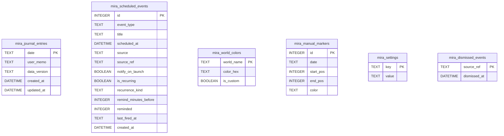

# Database Schema

> Mira のメインデータベース (`Data/db/mira.db`) のスキーマリファレンス。
> スキーマ定義の一次情報は `src-tauri/src/db/migrations.rs` の `run` 関数。
>
> **対象読者**: スキーマ定義・マイグレーション戦略・StellaRecord DB 参照経路を把握したい開発者および技術評価者。
> **関連ドキュメント**: 各テーブルを利用する IPC コマンドの挙動は [spec.md](spec.md)、永続化方針の意思決定は [tech-stack.md](tech-stack.md) を参照。

## Table of Contents

- [Overview](#overview)
- [Conventions](#conventions)
- [ER Diagram](#er-diagram)
- [Tables](#tables)
  - [mira_journal_entries](#mira_journal_entries)
  - [mira_scheduled_events](#mira_scheduled_events)
  - [mira_world_colors](#mira_world_colors)
  - [mira_manual_markers](#mira_manual_markers)
  - [mira_settings](#mira_settings)
  - [mira_dismissed_events](#mira_dismissed_events)
- [Default Settings](#default-settings)
- [Indexes](#indexes)
- [Initialization and PRAGMA](#initialization-and-pragma)
- [Migrations](#migrations)
- [StellaRecord DB References](#stellarecord-db-references)
- [Backup and Restore](#backup-and-restore)
- [Performance Notes](#performance-notes)

---

## Overview

| Property          | Value                                           |
| ----------------- | ----------------------------------------------- |
| Engine            | SQLite 3 (via rusqlite 0.38, `bundled` feature) |
| Journal Mode      | WAL (Write-Ahead Logging)                       |
| Foreign Keys      | Enforced (`PRAGMA foreign_keys = ON`)           |
| Tables            | 6                                               |
| Views             | 0                                               |
| Indexes           | 4 (一意インデックスを含む)                     |
| Schema Definition | `src-tauri/src/db/migrations.rs`                |

Mira DB はユーザーが入力したメモ・予定・手動マーカーと、世界色のキャッシュ・dismiss 履歴を保管する。VRChat のログ由来データは Mira DB には保管せず、StellaRecord DB を読み取り専用で参照する。

---

## Conventions

### Naming

| Element     | Convention                                              | Example                     |
| ----------- | ------------------------------------------------------- | --------------------------- |
| Table name  | `mira_` プレフィックス + snake_case                     | `mira_journal_entries`      |
| Column name | snake_case                                              | `scheduled_at`, `start_pos` |
| Primary key | `id INTEGER PRIMARY KEY AUTOINCREMENT` (一部は自然キー) | -                           |
| Timestamp   | `DATETIME` 型、`'YYYY-MM-DD HH:MM:SS'` 文字列           | `scheduled_at`              |
| Boolean     | `BOOLEAN`（SQLite 内部は INTEGER 0/1）                  | `is_recurring`, `reminded`  |
| Enum        | `TEXT CHECK(col IN (...))`                              | `event_type`, `source`      |

### Type Mapping

| Declared Type | Storage Class | Rust Type                                    |
| ------------- | ------------- | -------------------------------------------- |
| `INTEGER`     | INTEGER       | `i64`, `u32`, `usize`                        |
| `TEXT`        | TEXT          | `String`                                     |
| `DATETIME`    | TEXT          | `String`（`chrono::NaiveDateTime` でパース） |
| `BOOLEAN`     | INTEGER       | `bool`                                       |

### Idempotency

| Table                   | Idempotency Mechanism                                   |
| ----------------------- | ------------------------------------------------------- |
| `mira_journal_entries`  | `date PRIMARY KEY` + UPSERT                             |
| `mira_world_colors`     | `world_name PRIMARY KEY` + `INSERT OR IGNORE`           |
| `mira_settings`         | `key PRIMARY KEY` + `INSERT OR IGNORE` (デフォルト投入) |
| `mira_dismissed_events` | `source_ref PRIMARY KEY` + `INSERT OR REPLACE`          |

---

## ER Diagram



テーブル間に明示的な FK は張っていない (`mira_manual_markers.date` は `mira_journal_entries.date` と参照関係にあるが宣言なし)。これは「メモが存在しない日にも手動マーカーが入る」という運用を許容するため。

---

## Tables

### mira_journal_entries

1 日 1 レコードのジャーナルエントリ。ユーザーメモを保管する。

| Column         | Type     | Nullable | Default | Description                                    |
| -------------- | -------- | -------- | ------- | ---------------------------------------------- |
| `date`         | TEXT     | NO       | -       | 対象日 (`YYYY-MM-DD`)、プライマリキー          |
| `user_memo`    | TEXT     | YES      | NULL    | ユーザーメモ本文                               |
| `data_version` | TEXT     | YES      | NULL    | (現状未使用、将来の差分マイグレーション用予約) |
| `created_at`   | DATETIME | NO       | -       | 初回作成時刻                                   |
| `updated_at`   | DATETIME | NO       | -       | 最終更新時刻                                   |

**Constraints**

- `PRIMARY KEY (date)`

**Notes**

- メモの保存は UPSERT (`INSERT ... ON CONFLICT(date) DO UPDATE`)。
- `mira_settings.memo_max_length` (既定 1000) を超える文字数は `commands::journal::save_day_memo` で Unicode scalar 単位に切り詰めてから書き込む。

---

### mira_scheduled_events

ユーザー登録の予定イベント。

| Column                  | Type     | Nullable | Default       | Description                                     |
| ----------------------- | -------- | -------- | ------------- | ----------------------------------------------- |
| `id`                    | INTEGER  | NO       | AUTOINCREMENT | プライマリキー                                  |
| `event_type`            | TEXT     | NO       | -             | イベント種別                                    |
| `title`                 | TEXT     | NO       | -             | 表示名                                          |
| `scheduled_at`          | DATETIME | NO       | -             | 開始時刻                                        |
| `source`                | TEXT     | NO       | -             | 由来種別                                        |
| `source_ref`            | TEXT     | YES      | NULL          | 外部 ID (現状は自身の id を文字列化)            |
| `notify_on_launch`      | BOOLEAN  | NO       | 1             | 起動時通知に含めるか                            |
| `is_recurring`          | BOOLEAN  | NO       | 0             | 繰り返しイベントか                              |
| `recurrence_kind`       | TEXT     | YES      | NULL          | 繰り返し種別 (`weekly` のみ実装)                |
| `remind_minutes_before` | INTEGER  | NO       | 10            | リマインダー秒数 (分単位、最大 1440)            |
| `reminded`              | INTEGER  | NO       | 0             | 通知済みフラグ (繰り返し時は最終発火時刻と併用) |
| `last_fired_at`         | TEXT     | YES      | NULL          | 繰り返しイベントの最終発火時刻                  |
| `created_at`            | DATETIME | NO       | -             | 登録時刻                                        |

**Constraints**

- `PRIMARY KEY (id)`
- `CHECK (event_type IN ('reservation'))`
- `CHECK (source IN ('user'))`
- `CHECK (notify_on_launch IN (0, 1))`
- `CHECK (is_recurring IN (0, 1))`

**Indexes**

- `idx_mira_scheduled_events_scheduled_at (scheduled_at)`

---

### mira_world_colors

ワールド名から生成された色のキャッシュ。

| Column       | Type    | Nullable | Default | Description                                                                    |
| ------------ | ------- | -------- | ------- | ------------------------------------------------------------------------------ |
| `world_name` | TEXT    | NO       | -       | プライマリキー (StellaRecord に `world_id` が無いため `world_name` を識別子化) |
| `color_hex`  | TEXT    | NO       | -       | `#rrggbb` 形式                                                                 |
| `is_custom`  | BOOLEAN | NO       | 0       | ユーザー手動変更フラグ (現状常に 0、将来 UI 用予約)                            |

**Constraints**

- `PRIMARY KEY (world_name)`
- `CHECK (is_custom IN (0, 1))`

**Notes**

- `logic::world_color::get_or_create_color` が `world_name` から決定論的 HSL 値を生成し、初回参照時に INSERT する。
- ワールドが改名された場合は別ワールド扱いとなり、別の色が再生成される。

---

### mira_manual_markers

ユーザーが手動で付けた色付きマーカー。

| Column      | Type    | Nullable | Default       | Description                                   |
| ----------- | ------- | -------- | ------------- | --------------------------------------------- |
| `id`        | INTEGER | NO       | AUTOINCREMENT | プライマリキー                                |
| `date`      | TEXT    | NO       | -             | 対象日 (`YYYY-MM-DD`)                         |
| `start_pos` | INTEGER | NO       | -             | 開始位置 (Unicode scalar 単位、L7-MarkerUnit) |
| `end_pos`   | INTEGER | NO       | -             | 終了位置 (Unicode scalar 単位、半開区間)      |
| `color`     | TEXT    | NO       | `'red'`       | 色キー (`red` / `blue` / `green` / `orange`)  |

**Constraints**

- `PRIMARY KEY (id)`
- `CHECK (start_pos < end_pos)`

**Indexes**

- `idx_mira_manual_markers_date (date)`

**Notes**

- `start_pos` / `end_pos` はフロントの `getSelectionOffsets` が算出した **Unicode scalar (char) 位置** を格納する。
- 自動マーカー (`logic::marker.rs`) も UTF-8 バイト位置を Unicode scalar 単位に変換して返すため、手動 / 自動マーカーの座標系は完全に一致する (L7-MarkerUnit)。絵文字混在時もズレが生じない。

---

### mira_settings

key-value 形式のアプリ全体設定。

| Column       | Type | Nullable | Default  | Description                                                                                  |
| ------------ | ---- | -------- | -------- | -------------------------------------------------------------------------------------------- |
| `key`        | TEXT | NO       | -        | 設定キー、プライマリキー                                                                     |
| `value`      | TEXT | NO       | -        | 設定値 (常に文字列、必要に応じて呼び出し側で型変換)                                          |
| `value_type` | TEXT | NO       | `'text'` | 値の本来の型を示すヒント (`bool` / `int` / `text`)。`set_setting` でブール型キーは強制セット |

**Constraints**

- `PRIMARY KEY (key)`

**Notes**

- 既知のキーはマイグレーションで `INSERT OR IGNORE` のデフォルト投入が走る。
- `get_settings` は知られたキーを `MiraSettings` 構造体に整形して返し、未知キーは無視。
- ブール値は `"0"` / `"1"`、数値は文字列化された整数として保存。

---

### mira_dismissed_events

ユーザーが恒久 dismiss した通知ソースの履歴。

| Column         | Type     | Nullable | Default | Description                          |
| -------------- | -------- | -------- | ------- | ------------------------------------ |
| `source_ref`   | TEXT     | NO       | -       | 通知ソースの安定キー、プライマリキー |
| `dismissed_at` | DATETIME | NO       | -       | dismiss した時刻                     |

**Constraints**

- `PRIMARY KEY (source_ref)`

**Indexes**

- `idx_mira_dismissed_events_dismissed_at (dismissed_at)`

**Notes**

- 非繰り返し予定: `source_ref = "<event_id>"`
- 繰り返し予定: `source_ref = "<event_id>_YYYY-MM-DD"` (発火日付を含める)
- `get_pending_notifications` は `mira_dismissed_events` の `source_ref` を除外して返す。

---

## Default Settings

`migrations.rs::run` で投入される `mira_settings` のデフォルト値。

| Key                      | Default Value  | Type Hint |
| ------------------------ | -------------- | --------- |
| `font_family`            | `Yomogi`       | TEXT      |
| `font_scope`             | `content_only` | TEXT      |
| `memo_max_length`        | `1000`         | INTEGER   |
| `transition_enabled`     | `1`            | BOOLEAN   |
| `snapshot_enabled`       | `1`            | BOOLEAN   |
| `last_snapshot_seen`     | `` (空)        | TEXT      |
| `last_annual_seen`       | `` (空)        | TEXT      |
| `onboarding_completed`   | `0`            | BOOLEAN   |
| `view_hour_start`        | `` (空 = 自動) | INTEGER   |
| `view_hour_end`          | `` (空 = 自動) | INTEGER   |
| `voicevox_enabled`       | `0`            | BOOLEAN   |
| `voice_character`        | `metan`        | TEXT      |
| `reminder_sound_enabled` | `1`            | BOOLEAN   |

`INSERT OR IGNORE` のため、既存値は温存される。

---

## Indexes

明示的に作成されるインデックス一覧。`idx_mira_scheduled_events_unique` は重複予定を防ぐ一意インデックス。

| Index                                    | Table                   | Columns        | Purpose                     |
| ---------------------------------------- | ----------------------- | -------------- | --------------------------- |
| `idx_mira_scheduled_events_scheduled_at` | `mira_scheduled_events` | `scheduled_at` | 時系列ソート + 期限到来検索 |
| `idx_mira_manual_markers_date`           | `mira_manual_markers`   | `date`         | 日付単位の取得              |
| `idx_mira_dismissed_events_dismissed_at` | `mira_dismissed_events` | `dismissed_at` | dismiss 履歴の時系列ソート  |
| `idx_mira_scheduled_events_unique`       | `mira_scheduled_events` | `title`, `scheduled_at` | 予定名と開始時刻の重複防止 |

---

## Initialization and PRAGMA

`src-tauri/src/db/mira_db.rs::open_or_create` がアプリ起動時に実行される。

```rust
pub fn open_or_create() -> Result<Connection> {
    let path = get_db_path();
    let conn = Connection::open(&path)?;

    conn.execute_batch("PRAGMA journal_mode = WAL;")?;
    conn.execute_batch("PRAGMA foreign_keys = ON;")?;

    migrations::run(&conn)?;

    Ok(conn)
}
```

### Active PRAGMAs

| PRAGMA         | Value | Reason                                                      |
| -------------- | ----- | ----------------------------------------------------------- |
| `journal_mode` | `WAL` | 並列読み + 書きを許すジャーナルモード。長時間ロックを避ける |
| `foreign_keys` | `ON`  | SQLite はデフォルト OFF のため明示的に有効化                |

---

## Migrations

`migrations::run` は冪等な防御的マイグレーションで構成される。

| Order | Operation                                                               | Purpose                                         |
| ----- | ----------------------------------------------------------------------- | ----------------------------------------------- |
| 1     | `CREATE TABLE IF NOT EXISTS` × 6                                        | 現行テーブル群を作成                            |
| 2     | `DROP TABLE IF EXISTS mira_favorite_users`                              | R2-M-23: お気に入りユーザー機能撤去             |
| 3     | `drop_column_if_exists(mira_journal_entries, template_id)`              | R2-M-24: 未実装カラム撤去                       |
| 4     | `drop_column_if_exists(mira_journal_entries, generated_summary)`        | R2-M-24: 未実装カラム撤去                       |
| 5     | `drop_column_if_exists(mira_scheduled_events, description)`             | R2-M-24: 未実装カラム撤去                       |
| 6     | `mira_world_colors` の `world_id` 列存在チェック → 検出時テーブル再作成 | R2-M-26: 主キー切替 (`world_id` → `world_name`) |
| 7     | `add_column_if_missing(mira_scheduled_events, remind_minutes_before)`   | R2-M-11: 後付け追加                             |
| 8     | `add_column_if_missing(mira_scheduled_events, reminded)`                | R2-M-11: 後付け追加                             |
| 9     | `add_column_if_missing(mira_scheduled_events, recurrence_kind)`         | R2-M-11: 後付け追加                             |
| 10    | `add_column_if_missing(mira_scheduled_events, last_fired_at)`           | R2-M-11: 後付け追加                             |
| 11    | `CREATE INDEX IF NOT EXISTS` × 4                                        | 性能向上と重複予定の防止                       |
| 12    | `INSERT OR IGNORE` で既知設定キーのデフォルト投入                       | mira_settings 初期化                            |

### `add_column_if_missing` / `drop_column_if_exists`

`pragma_table_info('<table>')` で列の存在を確認してから `ALTER TABLE` を発行する。SQLite 3.35+ (rusqlite 0.38 bundled = SQLite 3.42+) の `DROP COLUMN` を使用。

### Migration Strategy

現状は `PRAGMA user_version` でスキーマバージョンを管理する。`migrations::run` は現在値を読み、未適用ステップだけを順に実行し、完了後に `CURRENT_SCHEMA_VERSION` を書き込む。各ステップは `IF NOT EXISTS` と列存在確認を併用し、既存環境での再実行にも耐える。

---

## StellaRecord DB References

Mira は以下の StellaRecord DB テーブル・ビューを **読み取り専用** で参照する。詳細スキーマは [StellaRecord docs/database.md](https://github.com/cosmoartsstore-private/stellarecord/blob/master/docs/database.md) を参照。

| Referenced By                                | Table/View      | Purpose                           |
| -------------------------------------------- | --------------- | --------------------------------- |
| `commands::journal::get_week_lane_data`      | `visit_summary` | 1 日の訪問ブロック (滞在時間付き) |
| `commands::journal::get_day_focus_data`      | `visit_summary` | 日次フォーカスの訪問ブロック      |
| `commands::journal::get_day_focus_data`      | `with_users`    | 訪問単位の同席ユーザー            |
| `commands::journal::get_day_focus_data`      | `screenshots`   | 日次写真リスト                    |
| `commands::journal::get_day_focus_data`      | `find_users`    | ユーザー表示名カタログ            |
| `commands::calendar::get_month_data`         | `visit_summary` | 月内アクティブ日の判定            |
| `commands::stella::register_to_stellarecord` | `apps` (書込)   | 自己登録 (例外的に書込み)         |

### Connection Mode

- `Connection::open_with_flags(path, SQLITE_OPEN_READ_ONLY)`
- `conn.busy_timeout(5 秒)` で StellaRecord の書込ロックを許容
- `PRAGMA query_only = ON` で SELECT 以外を二重防御

StellaRecord 未インストール時は `DbState.stella = Mutex<None>` となり、Mira の主機能は読込部分のみ無効化されて動作する。

---

## Backup and Restore

### Backup

`Data/db/` ディレクトリ全体をコピーすることでバックアップが可能。WAL モードのため、コピー時は以下の 3 ファイルを同時にコピーする。

| File          | Description            |
| ------------- | ---------------------- |
| `mira.db`     | メイン DB ファイル     |
| `mira.db-wal` | Write-Ahead Log        |
| `mira.db-shm` | 共有メモリインデックス |

アプリ終了時に WAL は自動 checkpoint されるため、終了後であれば `mira.db` のみのコピーでも一貫性が保たれる。

### Restore

別 PC への移行時は `Data/db/mira.db` をコピーする。レジストリの `InstallLocation` は環境ごとに異なるためコピー不要。

### External Tools

DB ファイルは標準的な SQLite 3 形式のため、以下のツールで直接読み出し可能。

- [`sqlite3`](https://sqlite.org/cli.html) CLI
- [DB Browser for SQLite](https://sqlitebrowser.org/)
- VSCode の SQLite 拡張機能

---

## Performance Notes

### Write Performance

- 書き込みは IPC ハンドラ単位で短時間ロック。長時間トランザクションは存在しない。
- メモ保存は 1 秒のフロントエンドデバウンスで頻度を抑制する (1 秒に 1 回以下)。

### Read Performance

- 週レーン取得は StellaRecord の `visit_summary` ビューに依存。`idx_visits_join_time` で時系列ソートが効く。
- 月別データは 1 ヶ月ぶんの `visit_summary` を 1 クエリで集約する。
- `mira_settings` は 13 行程度の小さなテーブルで、ページネーション不要。

### Storage

- Mira DB のサイズはユーザー利用量に依存。一般的な利用 (1 年分のメモ + 1000 件の予定) で 1〜5 MB 程度。
- 手動マーカーが大量に増えると `mira_manual_markers` が肥大化する可能性があるが、日付別ソート / 削除 UI で抑制可能。
- VACUUM は自動実行しない。長期運用で削除が多発した場合のみ手動 VACUUM を検討する。

---

## 関連ドキュメント

- [spec.md](spec.md) — 各テーブルを利用する IPC コマンドの挙動・データフロー
- [tech-stack.md](tech-stack.md) — `rusqlite` / WAL 採用の意思決定 (ADR-004)
- [../README.md](../README.md) — ユーザー向け概要・データ取り扱いポリシー
- [../DEVELOPMENT.md](../DEVELOPMENT.md) — ローカル DB のリセット手順・バックアップ
